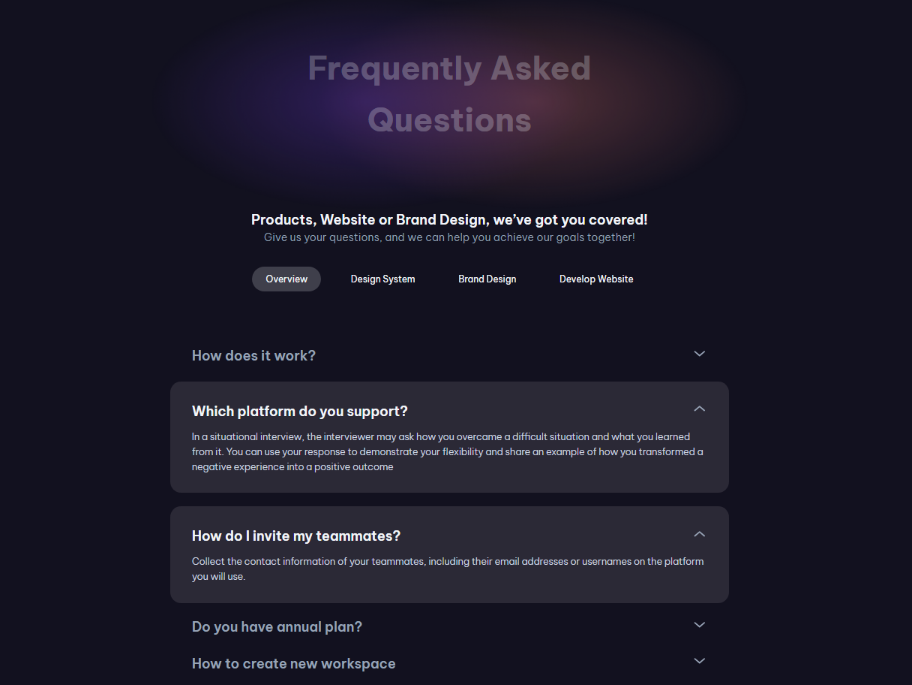

# FAQ Page

This is a solution to the FAQ Page on [devChallenges.io](https://devchallenges.io).

## Table of contents

- [Overview](#overview)
  - [Screenshot](#screenshot)
  - [Links](#links)
- [My process](#my-process)
  - [Built with](#built-with)
  - [Explanation](#explanation)
- [Credits](#credits)

## Overview

### Screenshot

This is a screenshot of the final view of the project.

### Links

- Solution URL: [https://github.com/thejxylog/faq-page-react](https://github.com/thejxylog/faq-page-react)
- Live Site URL: [https://faq-page-react-jayl.vercel.app/](https://faq-page-react-jayl.vercel.app)

## My process

### Built with

- React.js
- CSS Module

### Explanation

Used React.js, semantic HTML5 elements, CSS Module for the design.

## Credits

- Challenge site - [devChallenge.io](https://devchallenges.io/challenge/faq-page)
- Author - [Thu Nghiem](https://devchallenges.io/profile/ff6a2335-b279-4601-8927-85c85af7e7d8)
